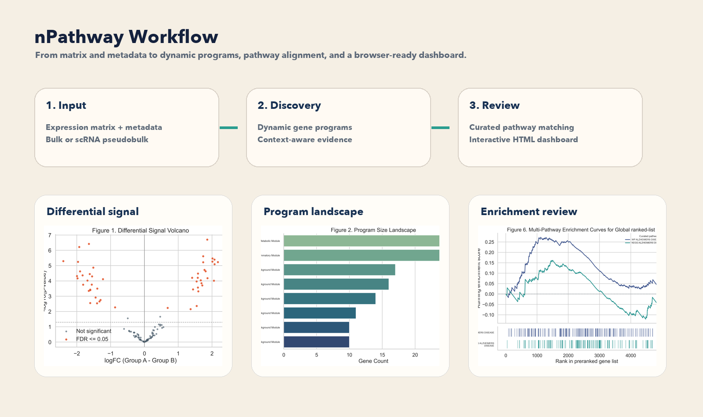
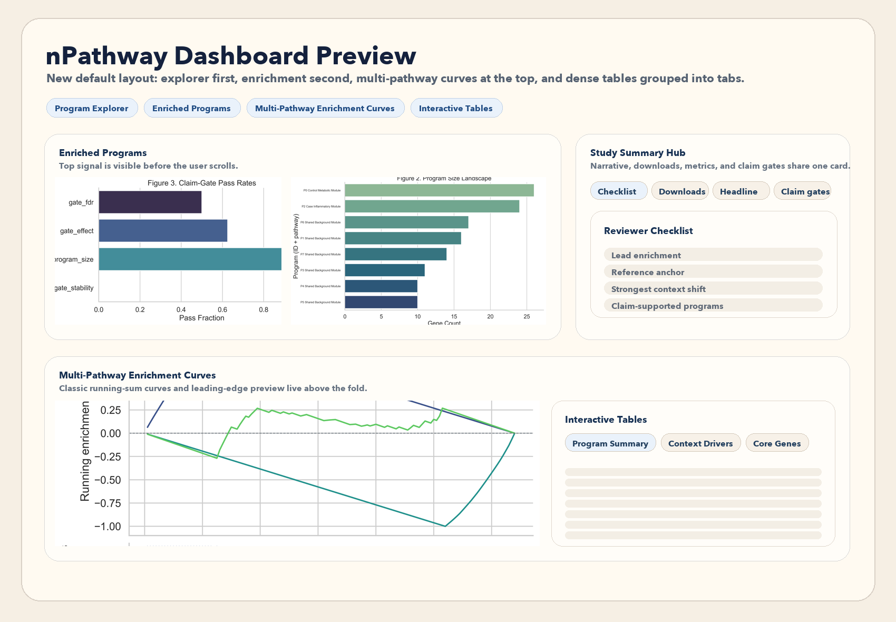

# nPathway

nPathway finds **dynamic gene programs** from transcriptomic data, aligns each program to curated pathways, and writes a local HTML dashboard that a biologist can open in a browser.

It is designed for two common situations:

- GSEA says a known pathway is enriched, but you want to see the **actual data-driven gene program** behind that signal.
- A disease signal spans more than one curated pathway, and you want a result that is easier to interpret than a long list of pathway hits.

nPathway works on **bulk RNA-seq** and **scRNA-seq** (through pseudobulk), and the main workflow starts from an **expression matrix plus metadata**. It does not require a DEG-only input table for the main discovery mode.



## What nPathway Gives You

- dynamic gene programs discovered from the data
- pathway matches against curated references
- a local `index.html` dashboard with **interactive plots and interactive tables**
- CSV tables, GMT files, and figure exports for review or manuscript work
- a cleaner way to explain why a result is biologically interesting



## Why This Is Different From Standard GSEA

Standard GSEA asks:

- is this **predefined** pathway enriched in my ranked gene list?

nPathway asks:

- what **data-derived gene program** is present in this dataset?
- which curated pathways best explain that program?
- which biologically relevant genes sit **outside** the original static pathway definition?

That means you can make a result easier to explain. For example:

- GSEA finds an Alzheimer's pathway.
- nPathway shows the matching dynamic program.
- that dynamic program may also contain additional disease-linked genes not included in the original curated GMT file.

## First 10 Minutes

### 1. Get the code

```bash
git clone https://github.com/kangk1204/nPathway.git
cd nPathway
```

Recommended Python:

- Python 3.10, 3.11, or 3.12

### 2. Option 1. One-click install

```bash
bash scripts/install_npathway_easy.sh
```

This creates a local virtual environment, installs nPathway, and smoke-checks the installed commands.
The installer auto-prefers `python3.11`, `python3.12`, or `python3.10` when available.

Then activate the environment and verify the install:

```bash
source .venv/bin/activate
npathway --help
npathway quickstart
```

### 3. Run the demo

```bash
npathway demo bulk --output-dir results/demo_bulk_case_vs_control
npathway demo scrna --output-dir results/demo_scrna_case_vs_control
```

Both demo commands build the dashboard by default.

### 4. Open the dashboard

Main files:

- `results/demo_bulk_case_vs_control/index.html`
- `results/demo_scrna_case_vs_control/index.html`

Open them in any browser.

On macOS:

```bash
open results/demo_bulk_case_vs_control/index.html
open results/demo_scrna_case_vs_control/index.html
```

On Linux:

```bash
xdg-open results/demo_bulk_case_vs_control/index.html
xdg-open results/demo_scrna_case_vs_control/index.html
```

You can also double-click `index.html` in Finder or File Explorer.

### 5. How to read your first result

Start with `index.html`.

Look at the dashboard in this order:

1. `Program Explorer`
   - choose one program and let the other panels follow it
2. `Enriched Programs`
   - this is the fastest way to see which dynamic programs rise to the top
   - first look at `NES`, `FDR`, and program identity
3. `Multi-Pathway Enrichment Curves`
   - this is the closest view to a classic GSEA enrichment plot
   - use it to compare multiple curated pathways on the same ranked gene list
   - the table beside it also shows `leading-edge` genes
4. `Program vs Reference Overlap`
   - this shows how the selected dynamic program relates to curated pathway names
5. `Context driver genes` and `Core genes in selected program`
   - these tell you which genes explain the biology and which genes are most central to the program
6. `Interactive Tables`
   - the dense tables are grouped into tabs: `Program Summary`, `Context Drivers`, and `Core Genes`
   - this keeps the dashboard readable when labels are long
7. `Reference Layers`
   - this groups pathway matches by source such as `Reactome`, `WikiPathways`, `Pathway Commons`, `GO`, `Hallmark`, or `KEGG`
   - use it to avoid mixing different knowledge layers without noticing

A program is usually more interesting when:

- `FDR` is low
- `NES` is meaningfully shifted from zero
- the program has a coherent curated match
- the same program contains biologically plausible genes beyond the static pathway definition

Important interpretation rule:

- `Core-weight score` is a **within-program membership score**
- it is **not** the same thing as log fold-change

## The 3 Main Ways To Use nPathway

### 1. Discovery mode for bulk RNA-seq

Use this when you have a sample-level expression matrix and metadata.

Input files:

- matrix: CSV/TSV
- metadata: CSV/TSV

Supported matrix layouts:

- `genes_by_samples`: first column is gene ID, remaining columns are samples
- `samples_by_genes`: first column is sample ID, remaining columns are genes

Minimum rule:

- Hard minimum: **2 samples per group**
- Recommended: **3 or more samples per group**

Example matrix:

```csv
gene,S1,S2,S3,S4
TREM2,120,110,80,75
BIN1,55,51,90,95
APOE,200,180,130,120
```

Example metadata:

```csv
sample,condition
S1,case
S2,case
S3,control
S4,control
```

Validate first:

```bash
npathway validate bulk \
  --matrix data/my_bulk_matrix.csv \
  --metadata data/my_bulk_metadata.csv \
  --sample-col sample \
  --group-col condition \
  --group-a case \
  --group-b control \
  --html-out results/my_bulk_validation.html
```

Run the beginner-friendly bulk workflow:

```bash
npathway run bulk \
  --matrix data/my_bulk_matrix.csv \
  --metadata data/my_bulk_metadata.csv \
  --sample-col sample \
  --group-col condition \
  --group-a case \
  --group-b control \
  --raw-counts \
  --output-dir results/my_bulk_run
```

Notes:

- use `--raw-counts` for count matrices
- omit `--raw-counts` for already normalized or log-scale compatible matrices
- the bulk workflow can also reuse an external ranked gene table with `--ranked-genes`
- if you want a broader public reference layer for annotation, add sources such as `reactome`, `wikipathways`, or `pathwaycommons` to `--annotation-collections`
- built-in MSigDB support is broader than the default slice and now includes aliases such as `go_cc`, `go_mf`, `c2_cp`, `c7`, `msigdb_reactome`, and `msigdb_wikipathways`

Example with broader public references:

```bash
npathway run bulk \
  --matrix data/my_bulk_matrix.csv \
  --metadata data/my_bulk_metadata.csv \
  --sample-col sample \
  --group-col condition \
  --group-a case \
  --group-b control \
  --raw-counts \
  --annotation-collections hallmark,go_bp,go_cc,c2_cp,reactome,wikipathways,pathwaycommons \
  --output-dir results/my_bulk_public_refs
```

If you want to prebuild the merged public reference GMT yourself:

```bash
npathway references build --output-dir data/reference/public
```

### 2. Discovery mode for scRNA-seq

Use this when you have an annotated `AnnData (.h5ad)` object.

Input:

- one `.h5ad` file

Required `adata.obs` fields:

- sample or donor column
- condition or group column

Important rule:

- each donor/sample must map to **exactly one** group label

Official scRNA route:

- `npathway run scrna` for the easiest path
- `scripts/run_scrna_pseudobulk_dynamic_pathway.py` for the expert path
- the official pseudobulk case/control CLI for scRNA-seq runs case/control comparisons through donor-level pseudobulk

Minimum rule after filtering and pseudobulk:

- Hard minimum: **2 retained pseudobulk samples per group**
- Recommended: **3 or more retained donors/samples per group**

Validate first:

```bash
npathway validate scrna \
  --adata data/my_scrna.h5ad \
  --sample-col donor_id \
  --group-col condition \
  --group-a case \
  --group-b control \
  --subset-col cell_type \
  --subset-value CD4_T
```

Run the easy scRNA workflow:

```bash
npathway run scrna \
  --adata data/my_scrna.h5ad \
  --condition-col condition \
  --case case \
  --control control \
  --output-dir results/my_scrna_run
```

If you start from Seurat or raw 10x:

```bash
npathway convert seurat --check-only
npathway convert 10x --check-only
```

### 3. Comparison mode against curated GSEA

Use this when you already have:

- a **full ranked gene table**
- an nPathway dynamic GMT
- a curated GMT

This mode does **not** discover new programs. It compares curated pathways and dynamic programs on the **same ranking**.

This is the cleanest mode for reviewer-facing analyses such as:

- fair `same ranked list` comparisons against GSEA/MSigDB
- comparing nPathway vs curated Alzheimer-like pathways
- testing whether dynamic programs capture additional disease-linked genes outside the static set definition

Run it with:

```bash
npathway compare --help
```

Repository-local equivalent:

```bash
python scripts/run_curated_vs_dynamic_gsea.py --help
```

## Quick Demo Data

### Bulk demo

```bash
npathway demo bulk --output-dir results/demo_bulk_case_vs_control
```

This writes an interactive dashboard by default:

- `results/demo_bulk_case_vs_control/index.html`

Bundled demo files:

- `data/bulk_demo_case_vs_ctrl/bulk_matrix_case_ctrl_demo.csv`
- `data/bulk_demo_case_vs_ctrl/bulk_metadata_case_ctrl_demo.csv`
- `data/bulk_demo_case_vs_ctrl/bulk_reference_demo.gmt`

### scRNA demo

```bash
npathway demo scrna --output-dir results/demo_scrna_case_vs_control
```

This also writes an interactive dashboard by default:

- `results/demo_scrna_case_vs_control/index.html`

Bundled demo files:

- `data/scrna_demo_case_vs_ctrl/demo_scrna_case_ctrl.h5ad`
- `data/scrna_demo_case_vs_ctrl/demo_scrna_obs_preview.csv`
- `data/scrna_demo_case_vs_ctrl/scrna_reference_demo.gmt`

## Input Templates And Beginner Docs

Templates for your own data live in `data/templates/`.

Main template files:

- `data/templates/bulk_matrix_template.csv`
- `data/templates/bulk_metadata_template.csv`
- `data/templates/scrna_obs_template.csv`

Beginner docs:

- `docs/quickstart_input_guide.md`
- `docs/discovery_vs_comparison_modes.md`

Validator script:

- `scripts/validate_npathway_inputs.py`

## What nPathway Produces

Typical outputs include:

- `dynamic_programs.gmt`
- `de_results.csv`
- `ranked_genes_for_gsea.csv`
- pathway comparison tables
- `index.html` with interactive plots and interactive tables
- dashboard figure exports and CSV tables
- batch-QC figures in the batch-aware workflow
- `figure_ready/` bundles in the easy scRNA workflow

## How nPathway Differs From Standard GSEA

| Question | Standard GSEA | nPathway |
| --- | --- | --- |
| Starting point | Static curated gene sets | Dynamic programs discovered from the data |
| Main question | Is this known pathway enriched? | What program exists here, and how does it align to known pathways? |
| Can it add genes beyond the original pathway definition? | No | Yes |
| Can it reuse a DESeq2/limma/edgeR ranked list? | Yes | Yes |
| Main strength | Simple curated interpretation | Dynamic discovery plus curated grounding |

nPathway should not be framed as a replacement for every upstream statistical method. A safer framing is:

- upstream DE/ranking can come from `DESeq2`, `limma`, `edgeR`, or `dream`
- nPathway adds the dynamic gene program layer and the pathway interpretation layer

## Developer Install (Optional)

Base install:

```bash
pip install -e .
```

Developer install:

```bash
pip install -e ".[dev]"
```

Optional model extras:

```bash
pip install -e ".[scgpt]"
pip install -e ".[geneformer]"
pip install -e ".[scbert]"
pip install -e ".[all-models]"
```

Beginner entrypoint:

- `npathway`

Installed direct aliases:

- `npathway-validate-inputs`
- `npathway-demo`
- `npathway-bulk-workflow`
- `npathway-scrna-easy`
- `npathway-compare-gsea`
- `npathway-convert-seurat`
- `npathway-convert-10x`

If you prefer the older direct aliases, these still work:

- `npathway-demo bulk`
- `npathway-demo scrna`
- `npathway-demo`
- `npathway-validate-inputs`
- `npathway-bulk-workflow`
- `npathway-scrna-easy`
- `npathway-compare-gsea`
- `npathway-convert-seurat`
- `npathway-convert-10x`

## Public Repository Utilities

Public repository utilities kept in this checkout:

- `scripts/run_bulk_dynamic_pathway.py`
- `scripts/run_scrna_pseudobulk_dynamic_pathway.py`
- `scripts/run_batch_aware_bulk_workflow.py`
- `scripts/run_scrna_easy.py`
- `scripts/run_curated_vs_dynamic_gsea.py`
- `scripts/validate_npathway_inputs.py`
- `scripts/convert_seurat_to_h5ad.py`
- `scripts/convert_10x_to_h5ad.py`

Private manuscript materials, submission figures, and large generated results are intentionally kept out of the public GitHub snapshot.

Maintainer note:

- before pushing a public snapshot, run `bash scripts/prepare_public_github_snapshot.sh --dry-run`

## License

MIT
